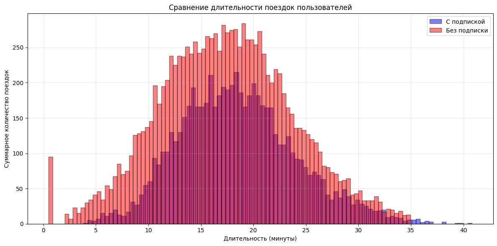
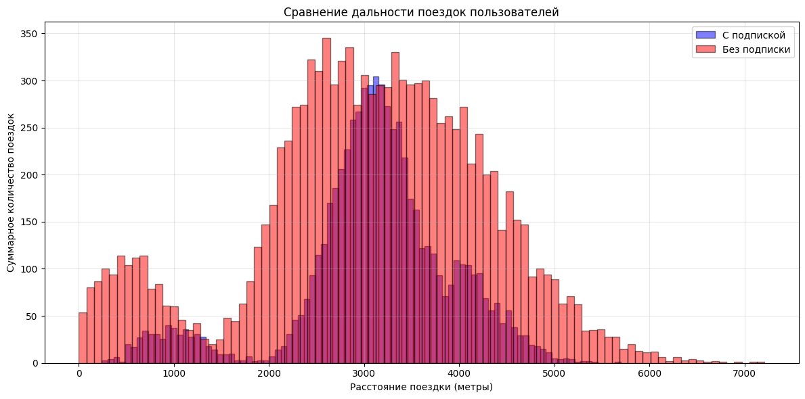

# Статистический анализ сервиса аренды самокатов

## О проекте
В проекте исследуются данные сервиса аренды самокатов, чтобы понять, как пользователи разных тарифов используют сервис и какие различия между ними значимы с точки зрения бизнеса.

Цель — проанализировать поведение пользователей, сравнить тарифы и проверить гипотезы, которые помогают принимать решения о развитии продукта и тарифной политики.

## Бизнес-задача
Сервису важно понимать, чем отличаются пользователи с подпиской и без подписки, как они влияют на выручку и какие продуктовые решения могут повысить эффективность бизнеса.

Анализ помогает ответить на ключевые бизнес-вопросы:
- как различается поведение пользователей разных тарифов;
- какие группы пользователей приносят больше ценности;
- есть ли статистически значимые различия между сегментами;
- какие выводы можно использовать для развития подписки и роста выручки.
- 
## Задачи
- подготовить данные к анализу: проверить качество таблиц, типы данных, пропуски, дубликаты и корректность значений;
- объединить данные о пользователях, поездках и тарифах в единую аналитическую выборку;
- применить методы описательной статистики для изучения структуры выборки и пользовательского поведения;
- исследовать распределения ключевых показателей, связанных с поездками;
- сравнить пользователей разных тарифов по основным метрикам использования сервиса;
- рассчитать пользовательские и финансовые показатели на основе данных о поездках;
- проверить статистические гипотезы с помощью t-тестов;
- решить прикладные задачи по теории вероятностей с использованием биномиального и нормального распределений;
- интерпретировать результаты статистического анализа и сформулировать выводы для бизнеса.
  
## Инструменты и технологии
- **Python** — язык программирования для анализа данных;
- **pandas** — предобработка данных, объединение таблиц и расчёт показателей;
- **NumPy** — численные вычисления;
- **matplotlib** — построение статистических графиков;
- **SciPy** — применение методов математической статистики: t-тест для независимых выборок, t-тест для одной выборки, а также работа с биномиальным и нормальным распределениями;
- **Jupyter Notebook** — среда для пошагового анализа и представления результатов.
  
## Визуализация проекта

### Сравнение длительности поездок пользователей разных тарифов

### Сравнение расстояния поездок пользователей разных тарифов

## Структура репозитория
- `README.md` — описание проекта
- `scooter_rental_statistical_analysis.ipynb` — ноутбук с анализом, проверкой гипотез и выводами

## Как открыть проект
Проект представлен в виде Jupyter Notebook с кодом, расчётами, визуализациями и выводами.
